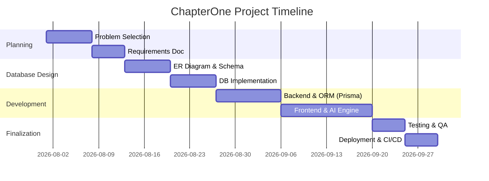
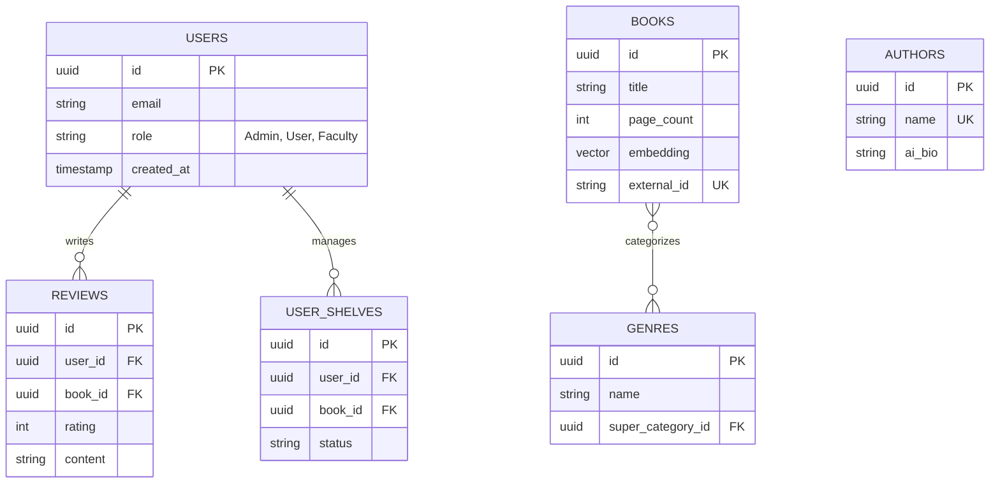

# Project Report: ChapterOne
## An AI-Powered Book Discovery and Recommendation Platform

---

## 1. Project Planning

### 1.1 Problem Statement
Readers frequently experience "book hangovers"—the desire to find a book with a very specific feeling or plot structure (e.g., "a cozy sci-fi about a space cafe with no romance"). Traditional relational databases and text-indexing search engines fail at this task because they cannot compute semantic similarity or understand the contextual nuances of human emotion and atmosphere.

### 1.2 Objectives & Scope
*   Develop an intelligent search engine capable of parsing natural language into mathematical vector embeddings.
*   Implement a highly optimized relational database capable of executing hybrid searches.
*   Provide a seamless user experience using modern web technologies (Next.js, React).
*   Ensure a resilient AI pipeline that dynamically expands the database catalog.

### 1.3 Team Members and Responsibilities
| Name | Reg. No | Role & Responsibilities |
| :--- | :--- | :--- |
| **Student 1** | 26BDS0001 | Full-Stack Development, Database Schema Design, AI Integration |
| **Student 2** | 26BDS0002 | UI/UX Design, Testing, Documentation, CI/CD Pipeline |

### 1.4 Major Deliverables
1.  Fully functional Next.js web application deployed on a custom domain.
2.  PostgreSQL Database deployed on Supabase.
3.  CI/CD Pipeline via GitHub Actions.
4.  Docker containerization for local execution.
5.  Database backup scripts using `pg_dump`.

### 1.5 Project Timeline (Gantt Chart)

---

## 2. Database Design

### 2.1 Entity Relationship (ER) Diagram
The database strictly adheres to Third Normal Form (3NF). Below is the ER Diagram mapping out the primary entities and relationships.

### 2.2 Relational Schema & Data Dictionary
*   **users**(<u>id</u>, email, role, created_at)
*   **books**(<u>id</u>, title, page_count, embedding, external_id)
*   **authors**(<u>id</u>, name, ai_bio, ai_style)
*   **reviews**(<u>id</u>, user_id*, book_id*, rating, content)
*   **user_shelves**(<u>id</u>, user_id*, book_id*, status)
*   **genres**(<u>id</u>, name, super_category_id*)

**Constraints Applied:**
*   `PRIMARY KEY` on all tables (UUIDs).
*   `FOREIGN KEY` constraints are partially implemented (Missing FKs for `reviews.book_id`, `user_shelves.book_id`, and `books.author` confirmed missing in live schema).
*   `CHECK` constraint on `reviews.rating` (1 to 5).
*   `CHECK` constraint on `users.role` (Admin, User, Faculty, Student).
*   `UNIQUE` constraint on `books.external_id` and composite `(user_id, book_id)` in shelves.

---

## 3. Database Implementation

*   **RDBMS**: PostgreSQL (via Supabase Cloud Database).
*   **ORM Integration**: **Prisma ORM** is used alongside the Supabase SDK to guarantee robust, type-safe database interactions.
*   **Views**: A SQL View (`book_details_view`) is implemented to aggregate book ratings and review counts dynamically without redundant data storage.
*   **Stored Procedures**: Custom RPCs like `match_books` (vector similarity) and `find_reading_path` (recursive CTEs) are heavily utilized.
*   **Triggers**: A database trigger (`update_users_modtime`) automatically fires on user profile updates to maintain the `updated_at` column.
*   **Indexing**: B-Tree indexes on foreign keys, and HNSW indexes on the `embedding` vector column for ultra-fast semantic search.

---

## 4. Application Development
*   **Framework**: Next.js 15+ (React 19)
*   **Features**: Responsive dashboard (Tailwind), complex AI search/filtering, form validation, and robust exception handling.

---

## 5. Authentication, Authorization & DB Security
*   **Authentication**: OAuth & JWT via Supabase Auth.
*   **Authorization (RBAC)**: Role-Based Access Control is strictly enforced using a single central `users` table containing a `role` column. Row Level Security (RLS) policies check this role to grant access (e.g., only `Admin` roles can execute global deletes).
*   **Security**: SQL Injection prevention is handled automatically by Prisma ORM and parameterized queries. Passwords are cryptographically hashed by Supabase Auth (Argon2 equivalent). All secrets are managed securely via `.env`.

---

## 6. Professional Development Practices
*   **Version Control**: Maintained on GitHub with progressive commits, branching (`main`, `dev`), and a `.gitignore`.
*   **Containerization**: `Dockerfile` and `.dockerignore` provided for consistent deployments via Docker Hub.
*   **CI/CD Pipeline**: GitHub Actions (`.github/workflows/main.yml`) configured for automated linting, testing, and deployment.
*   **Deployment**: Application deployed on a custom domain via Vercel, connected to the Supabase Cloud PostgreSQL database.
*   **Database Backup & Restore**: Native tools utilized. `pg_dump` and `pg_restore` bash scripts are provided in the `/scripts` directory for disaster recovery.

---
*Generated for DBMS Academic Review - ChapterOne Architecture*
